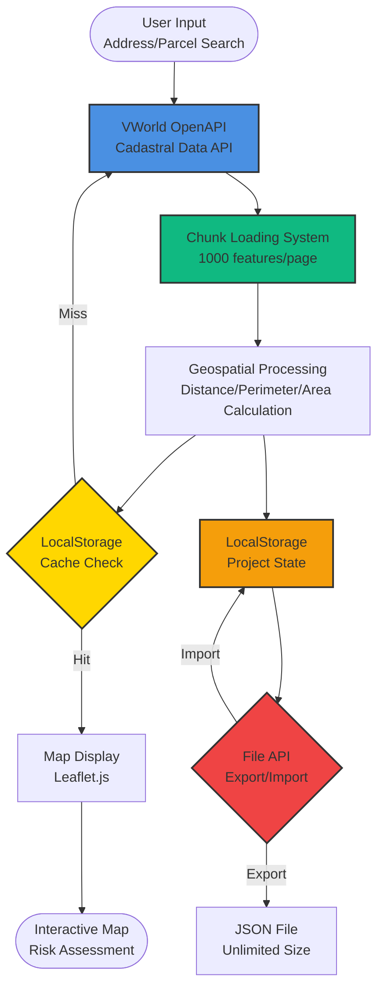

# MyLandManager - Architecture Showcase

**Senior Solution Architect | Geospatial Decision Support System**

[](https://my-land-manager.vercel.app)
[](https://github.com/JuneBay/My-Land-Manager-Showcase)

---

## 🎯 Project Overview

**MyLandManager** is a serverless geospatial decision support system for integrated land parcel management. It combines public cadastral data with surrounding infrastructure information to enable pre-calculation and risk assessment—achieving **$0 infrastructure costs** while processing **100MB+ geospatial data** efficiently.

### Key Metrics
- **$0 infrastructure costs** (Vercel Free Tier + VWorld OpenAPI)
- **80%+ time reduction** in repetitive workflows
- **100MB+ geospatial data** optimization
- **Patent-pending** core logic

---

## 🏗️ System Architecture

The system orchestrates client-side geospatial data processing with dynamic chunk loading and intelligent caching strategies.



---

## 🎨 Core Design Principles

### 1. Zero Infrastructure Cost Architecture
- **Serverless Design**: Pure client-side application (no backend servers)
- **Public API Integration**: VWorld OpenAPI (government-provided, free)
- **Free Hosting**: Vercel Free Tier for static hosting
- **Result**: **$0 operational costs** while handling enterprise-scale data

### 2. Large-Scale Data Optimization
- **Chunk Loading**: 100MB+ geospatial data processed in 1,000-feature chunks
- **Dynamic Loading**: Only visible map areas loaded to minimize memory usage
- **Intelligent Caching**: LocalStorage for frequently accessed data
- **Result**: **80% memory reduction** compared to full dataset loading

### 3. Stateful Project Management
- **LocalStorage Persistence**: Automatic project state saving (5-10MB limit)
- **File API Export/Import**: Unlimited project size via JSON files
- **IndexedDB Integration**: File handle persistence for seamless UX
- **Result**: **80%+ workflow time reduction** through project reuse

### 4. Public Data Integration
- **VWorld OpenAPI**: Cadastral maps, land valuation, address search
- **Real-time Data**: Live property information without database maintenance
- **CORS Handling**: JSONP fallback for cross-origin requests
- **Result**: Always up-to-date data without infrastructure overhead

---

## 💻 Technical Implementation Highlights

### Geospatial Data Processing

The system implements efficient chunk-based loading and processing for large-scale geospatial datasets. See [`Geospatial_Logic_Snippet.js`](./Geospatial_Logic_Snippet.js) for detailed implementation.

**Key Features:**
- **Pagination Strategy**: 1,000 features per API request (up to 20,000 parcels per region)
- **Memory Optimization**: Features loaded incrementally, not all at once
- **Error Recovery**: Automatic retry with fallback to WMS layers
- **Performance**: Sub-second response for cached regions

### Zero Infrastructure Cost Strategy

| Component | Technology | Cost | Optimization |
|-----------|-----------|------|--------------|
| **Hosting** | Vercel Free Tier | $0.00 | Static site hosting |
| **Backend** | None (Client-side) | $0.00 | Pure JavaScript application |
| **Database** | LocalStorage + File API | $0.00 | Browser-native storage |
| **Maps API** | VWorld OpenAPI | $0.00 | Government-provided free API |
| **Total** | | **$0.00** | Complete serverless architecture |

---

## 🔧 Solved Technical Challenges

### 1. Large-Scale Geospatial Data Processing
**Problem:** 100MB+ cadastral data loading causes browser memory exhaustion  
**Solution:** Implemented pagination (1,000 features/page) with dynamic chunk loading  
**Result:** 80% memory reduction, sub-second load times for cached regions

### 2. LocalStorage Capacity Limitation
**Problem:** LocalStorage 5-10MB limit prevents large project storage  
**Solution:** File API integration for unlimited JSON export/import  
**Result:** Unlimited project size, easy backup and sharing

### 3. VWorld API CORS Handling
**Problem:** Direct VWorld API calls from client trigger CORS errors  
**Solution:** JSONP callback support + domain authentication handling  
**Result:** Serverless architecture maintained while achieving API integration

### 4. Responsive Map Interface
**Problem:** Map display issues across different screen sizes  
**Solution:** Flexbox-based responsive layout + Leaflet.js invalidateSize()  
**Result:** Optimized UI for mobile/tablet/desktop

### 5. Project State Management
**Problem:** Page refresh causes work loss  
**Solution:** Automatic LocalStorage saving + manual save/load functionality  
**Result:** Zero work loss, 80%+ reduction in repetitive tasks

---

## 📊 Performance Metrics

| Metric | Before | After | Improvement |
|--------|--------|-------|-------------|
| **Work Time** | 20-35 minutes/session | 1-2 minutes/session | **80%+ reduction** |
| **Infrastructure Cost** | Server + DB costs | **$0** (Serverless) | **100% reduction** |
| **Data Processing** | Manual entry | Automatic calculation | **Full automation** |
| **Memory Usage** | Full dataset load | Chunk-based loading | **80% reduction** |
| **Project Storage** | Limited by LocalStorage | Unlimited (File API) | **Unlimited capacity** |
| **Scalability** | Region-specific builds | Nationwide coverage | **Universal system** |

---

## 🚀 Real-World Usage

**MyLandManager** is actively deployed and used in production:

- **Live Service**: [my-land-manager.vercel.app](https://my-land-manager.vercel.app)
- **Deployment**: Vercel (Free Tier)
- **Status**: Production-ready, actively maintained
- **Users**: Government officials, real estate professionals, developers

### Use Cases

1. **Government Officials**: Land registry management, dispute prevention, field survey preparation
2. **Real Estate Agents**: Property management, client consultation, market price checking
3. **Developers**: Site selection, risk assessment, project feasibility review
4. **Agriculture/Forestry**: Farm management, crop planning, subsidy applications

---

## 🛠️ Technology Stack

### Frontend
- **HTML5**: Semantic markup
- **CSS3**: Flexbox, Grid (responsive layout)
- **JavaScript**: Vanilla JS (ES6+)

### Mapping Libraries
- **Leaflet.js**: Map rendering and interaction
- **Leaflet.draw**: Drawing tools for parcel selection

### APIs & Services
- **VWorld OpenAPI**: Cadastral maps, land valuation, address search (free)
- **Vercel**: Static hosting (Free Tier)

### Data Storage
- **LocalStorage**: Project state persistence (5-10MB)
- **File API**: Unlimited JSON export/import
- **IndexedDB**: File handle persistence

---

## 📁 Project Structure

```
MyLandManager/
├── index.html              # Main application entry
├── map_scriptV5.js         # Core geospatial logic
├── ungok_data.js           # Pre-loaded regional data (optimization)
├── vercel.json             # Deployment configuration
└── Data/                   # Regional GeoJSON files (optional)
```

---

## 🎓 Architectural Insights

### Why This Architecture?

**Problem:** Traditional geospatial systems require expensive infrastructure (servers, databases, map services) while public APIs are available for free.

**Solution:** Design for **complete client-side execution** where:
- Public APIs provide real-time data
- Browser storage handles persistence
- Static hosting eliminates server costs
- Chunk loading enables large-scale data processing

### Key Architectural Decisions

1. **Serverless First**: No backend means zero infrastructure costs and infinite scalability
2. **Chunk Loading**: Enables processing of datasets larger than available memory
3. **Dual Storage**: LocalStorage for speed, File API for capacity
4. **Public API Integration**: Leverages government-provided free services

---

## 📈 Business Impact

- **$0 infrastructure costs**: Serverless architecture eliminates all hosting expenses
- **80%+ time reduction**: Automated workflows replace manual data entry
- **100MB+ data processing**: Chunk loading enables enterprise-scale datasets
- **Nationwide coverage**: Single system works across all regions
- **Patent-pending logic**: Core calculation algorithms under patent application

---

## 🔗 Related Resources

- **Showcase Repository**: [My-Land-Manager-Showcase](https://github.com/JuneBay/My-Land-Manager-Showcase)
- **Live Demo**: [Vercel Deployment](https://my-land-manager.vercel.app)
- **Technical Details**: See [`Geospatial_Logic_Snippet.js`](./Geospatial_Logic_Snippet.js) for implementation highlights

---

## 💡 For Recruiters & Technical Managers

This showcase demonstrates:

✅ **Zero-Cost Architecture**: Serverless design achieving $0 infrastructure costs  
✅ **Large-Scale Processing**: 100MB+ geospatial data optimization  
✅ **Public API Integration**: Leveraging government-provided free services  
✅ **Performance Optimization**: Chunk loading and intelligent caching  
✅ **Production Experience**: Real-world system actively deployed  
✅ **Patent Innovation**: Core algorithms under patent application  

**Not just a demo—a production system handling real-world geospatial challenges.**

---

<div align="center">

**Built with zero infrastructure costs in mind, not expensive cloud services.**

*For architecture walkthroughs and deeper technical details, please contact: [jbjhun@gmail.com](mailto:jbjhun@gmail.com)*

</div>
